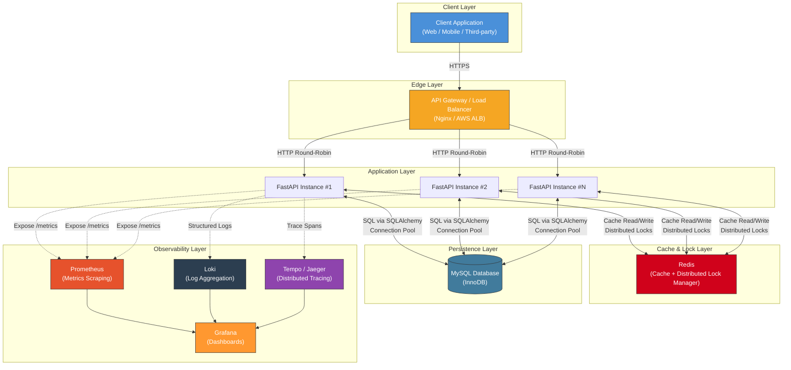
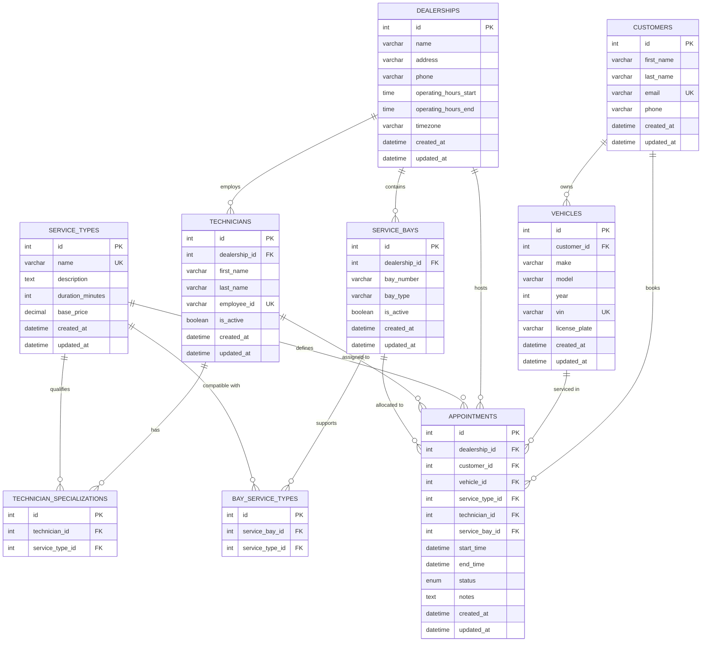
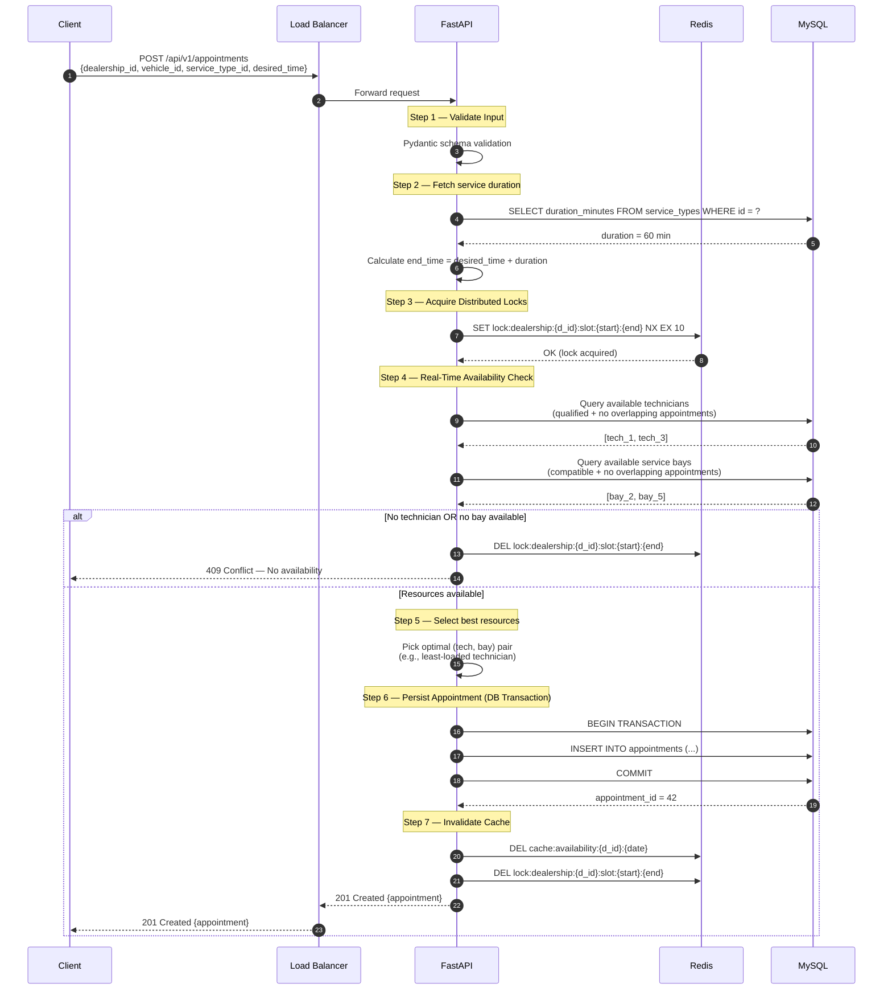
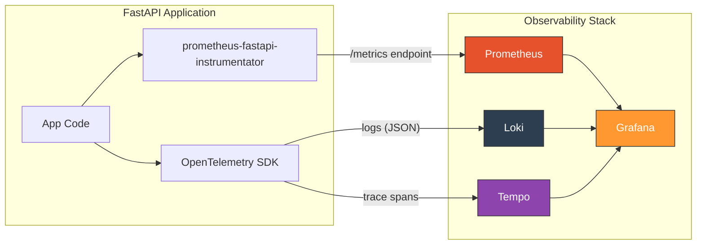

# System Design Document — The Unified Service Scheduler

> **Keyloop Technical Assessment · Scenario A**
> **Version:** 1.0
> **Date:** 2026-03-21
> **Author:** Luu Quoc Bao
> **Tech Stack:** FastAPI (Python) · MySQL · Redis

---

## Table of Contents

1. [Introduction & Problem Statement](#1-introduction--problem-statement)
2. [Ambiguity, Assumptions & Constraints](#2-ambiguity-assumptions--constraints)
3. [High-Level Architecture Diagram](#3-high-level-architecture-diagram)
4. [Component Roles](#4-component-roles)
5. [Data Model (ERD)](#5-data-model-erd)
6. [API Design Overview](#6-api-design-overview)
7. [Data Flow — Booking Request Lifecycle](#7-data-flow--booking-request-lifecycle)
8. [Concurrency Control — Redis Distributed Locking](#8-concurrency-control--redis-distributed-locking)
9. [Technology Justifications](#9-technology-justifications)
10. [Observability Strategy](#10-observability-strategy)
11. [Security Considerations](#11-security-considerations)
12. [Future Scalability Roadmap](#12-future-scalability-roadmap)
13. [AI Collaboration Narrative](#13-ai-collaboration-narrative)

---

## 1. Introduction & Problem Statement

Modern automotive dealerships manage service appointments through manual or semi-automated processes that are inherently error-prone. Double-bookings, under-utilised service bays, and idle technician time directly affect revenue and customer satisfaction.

**The Unified Service Scheduler** aims to replace these legacy workflows with a robust backend system that:

| # | Core Requirement | Description |
|---|---|---|
| 1 | **Resource Constrained Booking** | Accept a booking request specifying a *customer*, *vehicle*, *service type*, *dealership*, and *desired time slot*. The system must guarantee that the required resources (service bay + technician) are exclusively reserved. |
| 2 | **Real-Time Availability Check** | Before confirming, simultaneously verify that **both** a compatible `ServiceBay` **and** a qualified `Technician` are available for the **entire** duration of the requested service. |
| 3 | **Confirmed Appointment Record** | Upon successful validation, persist a complete `Appointment` record that durably associates the customer, vehicle, assigned technician, and allocated service bay. |

The system will expose a **RESTful API** backed by a **persistent relational database (MySQL)** and use **Redis** as an in-memory cache and distributed lock manager to prevent race conditions under concurrent load.

---

## 2. Ambiguity, Assumptions & Constraints

The assessment specification intentionally leaves certain details open-ended. The following assumptions have been made to produce a coherent, implementable design.

### 2.1 Domain Assumptions

| # | Assumption | Rationale |
|---|---|---|
| A1 | Each **Service Type** has a **fixed, pre-defined duration** (e.g., "Oil Change" = 60 min, "Full Service" = 180 min). | A fixed duration simplifies slot calculation and avoids dynamic estimation complexity. Duration can be stored as a column in the `service_types` table. |
| A2 | **Technicians have standard operating hours** per dealership (e.g., 08:00 – 17:00, Mon–Sat). | Operating hours define the bookable window. This is stored per-dealership and can be overridden per-technician if needed. |
| A3 | A **Technician is qualified for one or more Service Types**, modelled via a many-to-many relationship (`technician_specializations`). | Not every technician can perform every service. The scheduler must match service type to qualified technicians. |
| A4 | A **Service Bay is compatible with one or more Service Types** (e.g., a lift bay can handle tyre changes but not paint jobs). | Bay–service compatibility is modelled via a many-to-many relationship (`bay_service_types`). |
| A5 | **Appointments are booked in discrete time slots** aligned to configurable intervals (default: 30 min boundaries). | Discretisation prevents micro-overlaps and makes availability queries efficient. |
| A6 | A single appointment requires **exactly one Technician and exactly one Service Bay** for its entire duration. | Simplifies resource locking. Multi-bay or multi-tech services are out of scope for v1. |
| A7 | **Cancellation releases reservations** but a soft-delete pattern is used for audit trail. | Cancelled records are marked `status = "cancelled"` rather than physically deleted. |

### 2.2 Technical Assumptions

| # | Assumption | Rationale |
|---|---|---|
| T1 | The application is deployed behind a **reverse proxy / load balancer** (e.g., Nginx, AWS ALB) that handles TLS termination. | The FastAPI application itself runs on HTTP internally. |
| T2 | **Redis is deployed in a Sentinel or Cluster configuration** for production HA. For local development a single-node instance suffices. | Lock reliability is critical; a single Redis node is a SPOF. |
| T3 | **MySQL uses InnoDB** as the storage engine for ACID-compliant transactions. | Row-level locking and foreign key support are required. |
| T4 | **UTC is used for all internal timestamps.** Display timezone conversion is a client-side responsibility. | Eliminates ambiguity across dealerships in different time zones. |
| T5 | Authentication/authorization is **out of scope** for this assessment but the design includes a placeholder for JWT-based middleware. | Allows the architecture to be auth-ready without implementing a full identity provider. |

---

## 3. High-Level Architecture Diagram



---

## 4. Component Roles

### 4.1 API Gateway / Load Balancer (Nginx or AWS ALB)

| Responsibility | Detail |
|---|---|
| **TLS Termination** | Decrypts HTTPS traffic at the edge so internal services communicate over plain HTTP. |
| **Load Distribution** | Routes incoming requests across multiple FastAPI instances using round-robin or least-connections strategy. |
| **Rate Limiting** | Protects the backend from abuse by enforcing per-client request limits. |
| **Health Checking** | Periodically probes the `/health` endpoint of each FastAPI instance and removes unhealthy nodes from the pool. |

### 4.2 FastAPI Application Backend

| Responsibility | Detail |
|---|---|
| **RESTful API Surface** | Exposes versioned endpoints (`/api/v1/...`) for all CRUD operations on dealerships, technicians, bays, services, and appointments. |
| **Business Logic Engine** | Implements the core booking algorithm — availability check, resource locking, appointment creation — within a service layer. |
| **Input Validation** | Leverages Pydantic models for strict request/response schema enforcement and automatic OpenAPI documentation. |
| **Concurrency Orchestration** | Coordinates with Redis to acquire distributed locks before mutating shared resource state. |
| **Database Access** | Uses SQLAlchemy (async) with connection pooling to interact with MySQL. |

### 4.3 MySQL Database (InnoDB)

| Responsibility | Detail |
|---|---|
| **Persistent Source of Truth** | Stores all domain entities — dealerships, customers, vehicles, technicians, service bays, service types, and appointments. |
| **ACID Transactions** | Ensures booking creation is atomic: either all writes (appointment + resource reservation) succeed, or none do. |
| **Referential Integrity** | Foreign key constraints guarantee data consistency (e.g., an appointment cannot reference a non-existent technician). |
| **Indexing & Query Performance** | Composite indexes on `(dealership_id, start_time, end_time)` accelerate time-range availability queries. |

### 4.4 Redis (Cache & Distributed Lock Manager)

| Responsibility | Detail |
|---|---|
| **Availability Cache** | Caches pre-computed availability slots per dealership/date to reduce DB query pressure on high-read endpoints. |
| **Distributed Locking (Redlock Pattern)** | Prevents race conditions when two concurrent requests attempt to book the same bay or technician at an overlapping time. Locks are key-scoped (e.g., `lock:bay:{bay_id}:{date}`) with automatic TTL expiry. |
| **Cache Invalidation** | Upon a successful booking or cancellation, the relevant cached availability slots are evicted to ensure consistency. |
| **Idempotency Store** | Stores request idempotency keys (TTL-based) to prevent duplicate bookings from network retries. |

---

## 5. Data Model (ERD)



### Key Design Decisions

- **`APPOINTMENTS.status`** uses an ENUM with values: `pending`, `confirmed`, `in_progress`, `completed`, `cancelled`.
- **Soft delete** via status transition (`cancelled`) preserves the audit trail.
- **Composite unique constraint** on `(technician_id, start_time)` and `(service_bay_id, start_time)` at the database level provides a final safety net against double-booking, complementing the Redis-level lock.

---

## 6. API Design Overview

All endpoints are prefixed with `/api/v1` and follow RESTful conventions.

### Core Booking Endpoints

| Method | Endpoint | Description | Auth |
|--------|----------|-------------|------|
| `POST` | `/appointments` | Create a new appointment (triggers availability check + lock) | Required |
| `GET` | `/appointments/{id}` | Retrieve a single appointment by ID | Required |
| `GET` | `/appointments` | List appointments with filters (dealership, date range, status) | Required |
| `PATCH` | `/appointments/{id}` | Update appointment details or status | Required |
| `DELETE` | `/appointments/{id}` | Cancel an appointment (soft-delete) | Required |

### Availability Endpoint

| Method | Endpoint | Description | Auth |
|--------|----------|-------------|------|
| `GET` | `/availability` | Query available slots for a dealership + service type on a given date | Optional |

**Query Parameters:** `dealership_id`, `service_type_id`, `date`
**Response:** A list of available time slots, each paired with at least one eligible (technician, bay) combination.

### Resource Management Endpoints (CRUD)

| Resource | Endpoints |
|----------|-----------|
| Dealerships | `GET / POST / PATCH /api/v1/dealerships[/{id}]` |
| Customers | `GET / POST / PATCH /api/v1/customers[/{id}]` |
| Vehicles | `GET / POST / PATCH /api/v1/vehicles[/{id}]` |
| Technicians | `GET / POST / PATCH /api/v1/technicians[/{id}]` |
| Service Bays | `GET / POST / PATCH /api/v1/service-bays[/{id}]` |
| Service Types | `GET / POST / PATCH /api/v1/service-types[/{id}]` |

### Health & Diagnostics

| Method | Endpoint | Description |
|--------|----------|-------------|
| `GET` | `/health` | Liveness check (returns `200 OK`) |
| `GET` | `/health/ready` | Readiness check — verifies MySQL and Redis connectivity |

---

## 7. Data Flow — Booking Request Lifecycle

The following sequence diagram illustrates the end-to-end flow when a client submits a booking request.



### Step-by-Step Narrative

| Step | Action | Component | Purpose |
|------|--------|-----------|---------|
| **1** | **Input Validation** | FastAPI | Pydantic validates the request payload — all required fields present, correct types, `desired_time` is in the future. Returns `422` on failure. |
| **2** | **Resolve Duration** | FastAPI → MySQL | Fetch the `duration_minutes` for the requested `service_type_id`. Compute `end_time = desired_time + duration`. |
| **3** | **Acquire Distributed Lock** | FastAPI → Redis | Use `SET ... NX EX 10` (set-if-not-exists with 10s TTL) on a lock key scoped to `dealership + time_slot`. This prevents two concurrent requests from simultaneously passing the availability check for the same resources. |
| **4** | **Availability Query** | FastAPI → MySQL | Execute two queries in parallel: **(a)** find technicians at this dealership who are qualified for the service type AND have no existing appointments that overlap `[start_time, end_time)`. **(b)** Find service bays at this dealership that are compatible with the service type AND have no overlapping appointments. |
| **5** | **Resource Selection** | FastAPI | From the available technicians and bays, select the optimal pair. Default strategy: **least-loaded technician** (fewest appointments that day) and **first available bay**. |
| **6** | **Persist Appointment** | FastAPI → MySQL | Within a single database transaction, insert the `APPOINTMENTS` row with the selected `technician_id`, `service_bay_id`, and `status = "confirmed"`. The DB-level unique constraints serve as a final guard. |
| **7** | **Cleanup & Cache Bust** | FastAPI → Redis | Delete the cached availability data for the affected dealership + date pair to ensure subsequent availability queries return fresh data. Release the distributed lock. |

---

## 8. Concurrency Control — Redis Distributed Locking

### The Problem

Without external coordination, two API instances processing concurrent booking requests could both execute the availability check simultaneously, both find the same technician/bay free, and both insert an appointment — resulting in a **double-booking**.

### The Solution — Redis-Based Distributed Lock

```
Lock Key Format:  lock:dealership:{dealership_id}:slot:{start_iso}:{end_iso}
Lock Value:       {request_uuid}   (for safe release — only the owner can delete)
Lock TTL:         10 seconds       (auto-release if the holder crashes)
```

#### Acquisition Flow (Pseudocode)

```python
import redis.asyncio as redis
import uuid

async def acquire_booking_lock(
    redis_client: redis.Redis,
    dealership_id: int,
    start_time: str,
    end_time: str,
    timeout: int = 10,
) -> str | None:
    """Attempt to acquire a distributed lock for the booking slot.

    Returns the lock_id on success, None if the lock is already held.
    """
    lock_key = f"lock:dealership:{dealership_id}:slot:{start_time}:{end_time}"
    lock_id = str(uuid.uuid4())

    acquired = await redis_client.set(
        lock_key, lock_id, nx=True, ex=timeout
    )

    return lock_id if acquired else None


async def release_booking_lock(
    redis_client: redis.Redis,
    dealership_id: int,
    start_time: str,
    end_time: str,
    lock_id: str,
) -> None:
    """Release the lock only if we are the owner (compare lock_id)."""
    lock_key = f"lock:dealership:{dealership_id}:slot:{start_time}:{end_time}"

    # Lua script for atomic compare-and-delete
    lua_script = """
    if redis.call("GET", KEYS[1]) == ARGV[1] then
        return redis.call("DEL", KEYS[1])
    else
        return 0
    end
    """
    await redis_client.eval(lua_script, 1, lock_key, lock_id)
```

#### Why This Works

| Property | How It Is Achieved |
|---|---|
| **Mutual Exclusion** | `SET NX` guarantees only one client can hold the lock for a given key. |
| **Deadlock Freedom** | The `EX` (expiry) parameter ensures the lock auto-releases after the TTL, even if the holder crashes. |
| **Safe Release** | The Lua compare-and-delete script ensures only the lock owner can release it, preventing accidental release by a different request. |
| **Granularity** | Locking is scoped to `dealership + time range`, so bookings at different dealerships or non-overlapping times are never contended. |

### Defence in Depth — Database-Level Guard

Even with Redis locks, the MySQL schema includes a **database-level constraint** as a final safety net:

```sql
-- Prevent double-booking of technicians
ALTER TABLE appointments
    ADD CONSTRAINT uq_technician_slot
    UNIQUE (technician_id, start_time);

-- Prevent double-booking of service bays
ALTER TABLE appointments
    ADD CONSTRAINT uq_bay_slot
    UNIQUE (service_bay_id, start_time);
```

If the Redis lock fails for any reason (e.g., a network partition), the database will reject the duplicate insert with an `IntegrityError`, which the application layer catches and translates into a `409 Conflict` response.

---

## 9. Technology Justifications

### 9.1 FastAPI (Python)

| Criterion | Justification |
|---|---|
| **Performance** | FastAPI is one of the fastest Python frameworks, built on Starlette and uvicorn (ASGI). It rivals Node.js/Go for I/O-bound workloads such as database queries and Redis operations, which dominate this application's profile. |
| **Async-Native** | First-class `async/await` support enables non-blocking I/O. Database queries, Redis commands, and multiple availability checks can run concurrently within a single request cycle. |
| **Developer Productivity** | Pydantic-based request/response models provide automatic data validation, serialization, and interactive API documentation (Swagger UI / ReDoc) with zero extra code. |
| **Type Safety** | Python type hints combined with Pydantic give a TypeScript-like development experience that catches bugs at development time. |
| **Ecosystem** | Rich Python ecosystem for ORMs (SQLAlchemy), Redis clients (`redis-py`), testing (`pytest`), and observability (`opentelemetry-sdk`). |
| **Scalability** | Stateless by design — easily horizontally scaled behind a load balancer by spinning up additional uvicorn workers or container replicas. |

### 9.2 MySQL (InnoDB)

| Criterion | Justification |
|---|---|
| **ACID Compliance** | Booking creation requires atomic multi-row operations. InnoDB's transactional guarantees ensure an appointment is either fully created with all associations, or not at all. |
| **Referential Integrity** | Foreign key constraints between `appointments`, `technicians`, `service_bays`, `vehicles`, and `customers` prevent orphaned references and ensure data consistency. |
| **Mature & Battle-Tested** | MySQL is one of the most widely deployed RDBMS engines globally. It offers proven reliability, extensive tooling, and a deep knowledge base. |
| **Row-Level Locking** | InnoDB's row-level locking minimizes contention during concurrent writes to the `appointments` table, complementing the Redis-level distributed locks. |
| **Replication & HA** | MySQL supports primary-replica replication, Group Replication, and managed HA solutions (AWS RDS Multi-AZ, PlanetScale) for production resilience. |
| **Domain Fit** | The scheduling domain has a clearly relational data model with well-defined entities and relationships. A relational database is the natural, optimal fit. |

### 9.3 Redis

| Criterion | Justification |
|---|---|
| **Sub-Millisecond Latency** | Redis operates entirely in memory, providing the low-latency reads/writes necessary for real-time availability checks and lock operations. |
| **Distributed Locking** | Redis's `SET NX EX` primitive (and the more robust Redlock algorithm for multi-node setups) is the industry-standard approach for lightweight distributed locks — simpler and faster than database-level advisory locks. |
| **Cache Layer** | Availability data for popular dealerships/dates is read-heavy. Redis caching reduces repetitive MySQL queries and improves p99 response times. |
| **Atomic Operations** | Lua scripting support enables atomic compare-and-delete for safe lock release, eliminating TOCTOU (time-of-check-to-time-of-use) bugs. |
| **Versatility** | Beyond caching and locking, Redis can be extended to support rate limiting, session management, and pub/sub event notification in future iterations. |
| **Operational Simplicity** | Redis Sentinel provides automatic failover with minimal configuration. Managed services (AWS ElastiCache, Redis Cloud) reduce operational burden further. |

---

## 10. Observability Strategy

A production-grade system requires comprehensive observability across three pillars: **Metrics**, **Logging**, and **Tracing**.

### 10.1 Architecture



### 10.2 Metrics (Prometheus + Grafana)

| Metric | Type | Purpose |
|--------|------|---------|
| `http_requests_total` | Counter | Total HTTP requests by method, endpoint and status code |
| `http_request_duration_seconds` | Histogram | Request latency distribution (p50, p95, p99) |
| `booking_attempts_total` | Counter | Total booking attempts (labelled by outcome: `success`, `conflict`, `error`) |
| `redis_lock_acquisition_duration_seconds` | Histogram | Time spent acquiring distributed locks |
| `redis_lock_failures_total` | Counter | Number of failed lock acquisitions (contention indicator) |
| `db_query_duration_seconds` | Histogram | SQL query latency by query type |
| `active_db_connections` | Gauge | Current size of the SQLAlchemy connection pool |

**Alerting rules** (configured in Prometheus Alertmanager):
- `http_request_duration_seconds{quantile="0.99"} > 2s` → P2 alert
- `booking_attempts_total{outcome="error"}` rate > 5/min → P1 alert
- `active_db_connections` > 80% pool capacity → P2 alert

### 10.3 Logging (Structured JSON → Loki)

All application logs are emitted in **structured JSON** format using Python's `structlog` library.

```json
{
  "timestamp": "2026-03-21T10:15:30.123Z",
  "level": "INFO",
  "event": "booking_confirmed",
  "trace_id": "abc123def456",
  "span_id": "789ghi",
  "dealership_id": 5,
  "appointment_id": 42,
  "technician_id": 12,
  "service_bay_id": 3,
  "duration_ms": 87
}
```

**Key practices:**
- Every log line includes `trace_id` and `span_id` for correlation with distributed traces.
- Sensitive data (customer PII) is **never** logged in plain text.
- Log levels follow a strict hierarchy: `DEBUG` (local only), `INFO` (operational events), `WARNING` (degraded state), `ERROR` (failures), `CRITICAL` (system-level failures).

### 10.4 Distributed Tracing (OpenTelemetry → Tempo)

Each incoming request is assigned a **trace ID** that propagates across all internal operations:

```
Trace: POST /api/v1/appointments
├─ Span: validate_input              (2ms)
├─ Span: fetch_service_duration      (5ms)  → MySQL
├─ Span: acquire_redis_lock          (3ms)  → Redis
├─ Span: check_technician_avail      (12ms) → MySQL
├─ Span: check_bay_avail             (10ms) → MySQL
├─ Span: insert_appointment          (8ms)  → MySQL
├─ Span: invalidate_cache            (2ms)  → Redis
└─ Span: release_redis_lock          (1ms)  → Redis
Total: 43ms
```

This enables engineers to pinpoint bottlenecks (e.g., slow availability queries) and diagnose failures across the request lifecycle.

---

## 11. Security Considerations

Although full authentication implementation is out of scope, the architecture is designed with security in mind:

| Area | Strategy |
|---|---|
| **Transport Security** | TLS 1.3 enforced at the load balancer. HSTS headers enabled. |
| **Authentication** | JWT-based Bearer tokens validated by FastAPI middleware (`fastapi-jwt-auth` or custom). Tokens issued by an external identity provider (e.g., Auth0, Keycloak). |
| **Authorization** | Role-based access control (RBAC): `admin`, `dealer_staff`, `customer`. Endpoint permissions enforced via dependency injection. |
| **Input Validation** | Pydantic models reject malformed input. SQLAlchemy parameterized queries prevent SQL injection. |
| **Rate Limiting** | Implemented at the API Gateway level and optionally via Redis token-bucket at the application level. |
| **Data Protection** | Customer PII is encrypted at rest (MySQL TDE) and never logged. |

---

## 12. Future Scalability Roadmap

| Phase | Enhancement | Benefit |
|---|---|---|
| **v1.1** | Read replicas for MySQL | Scale read-heavy availability queries independently of writes. |
| **v1.2** | Event-driven notifications (Redis Pub/Sub or RabbitMQ) | Send confirmation emails/SMS asynchronously without blocking the booking flow. |
| **v2.0** | Multi-region deployment | Serve dealerships in different geographies from the nearest region. |
| **v2.1** | Predictive availability (ML) | Forecast peak demand and suggest alternative slots proactively. |
| **v2.2** | WebSocket real-time updates | Push live availability changes to connected clients (dashboards). |

---

## 13. AI Collaboration Narrative

> **This section documents how Generative AI tools were used as a collaborative partner during the design phase of this project.**

### 13.1 Overview

<!-- 
==========================================================================
PLACEHOLDER — Fill in with your specific experience.
The structure below provides a framework; customize each subsection with
concrete examples of your AI interaction.
==========================================================================
-->

Generative AI (GenAI) was employed as a **design-thinking accelerator** throughout the system design phase. Rather than replacing engineering judgment, the AI served as a sounding board for architectural decisions, a rapid prototyping tool for Mermaid diagrams, and a knowledge base for technology comparison.

### 13.2 How AI Was Directed

| Phase | Prompt Strategy | AI Contribution | My Engineering Judgment |
|---|---|---|---|
| **Initial Architecture** | *"Act as a Senior Backend Architect. Given these requirements [Scenario A], generate a system design document with Mermaid diagrams."* | Produced the initial architecture layout and component breakdown. | I reviewed the architecture for correctness, ensured it addressed all three core requirements, and refined the component interactions. |
| **Data Modelling** | *"Design an ERD for a service scheduling system with these entities..."* | Generated the Mermaid ERD with relationships and cardinalities. | I validated foreign key relationships, added missing junction tables (`technician_specializations`, `bay_service_types`), and ensured the model supports the domain constraints. |
| **Concurrency Design** | *"How should I use Redis to prevent double-booking in a distributed FastAPI application?"* | Proposed the `SET NX EX` locking pattern with Lua-based safe release. | I evaluated the approach against alternatives (DB advisory locks, optimistic locking), confirmed it was the right fit for the expected concurrency level, and added the defence-in-depth DB constraint strategy. |
| **Technology Justification** | *"Provide engineering arguments for FastAPI + MySQL + Redis in a scheduling domain."* | Generated comparison points across performance, reliability, and ecosystem criteria. | I filtered for arguments directly relevant to the scheduling domain and removed generic marketing-style points. |
| **Observability** | *"Outline a Prometheus + Grafana + Loki observability strategy for a FastAPI microservice."* | Proposed the three-pillar approach with specific metric names and alerting thresholds. | I customized the metrics to be domain-specific (e.g., `booking_attempts_total`, `redis_lock_failures_total`) and defined realistic alerting thresholds. |

### 13.3 Guardrails & Validation

- **Every AI output was manually reviewed** against the assessment rubric and scoring criteria.
- **Mermaid diagrams were rendered** and visually inspected for correctness before inclusion.
- **Code snippets were tested** in a local development environment.
- **Architectural decisions were validated** against industry best practices and personal experience.

### 13.4 Reflection

<!-- 
Update this section with your personal reflection after completing the assessment:
- What worked well with AI collaboration?
- Where did you need to override or significantly modify AI suggestions?
- How did AI change your workflow compared to working without it?
-->

*To be completed after the implementation phase.*

---

## Appendix A — Technology Stack Summary

| Layer | Technology | Version | Purpose |
|---|---|---|---|
| Runtime | Python | 3.11+ | Application language |
| Framework | FastAPI | 0.110+ | ASGI web framework |
| ASGI Server | Uvicorn | 0.27+ | High-performance ASGI server |
| ORM | SQLAlchemy | 2.0+ | Async database toolkit |
| Migrations | Alembic | 1.13+ | Database schema migration |
| Validation | Pydantic | 2.0+ | Data validation & serialization |
| Database | MySQL | 8.0+ | Persistent relational storage (InnoDB) |
| Cache / Locks | Redis | 7.0+ | In-memory cache & distributed lock manager |
| Redis Client | redis-py | 5.0+ | Async Redis client for Python |
| Observability | OpenTelemetry | 1.20+ | Metrics, traces, and logs instrumentation |
| Testing | pytest + httpx | latest | Unit and integration testing |
| Containerization | Docker + Compose | latest | Local development & deployment |

---

*End of System Design Document.*
